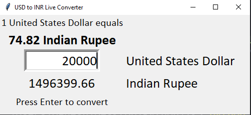
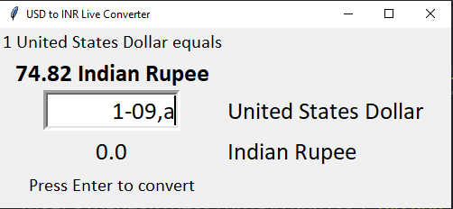

# Tkinter-Currency-Converter

## This code gets the live value of 1 USD to INR conversion rate using Requests and the same is used in Tkinter to calculate as shown below

### Code Explanation
Root widget is created first, and all other Labels and Entry widgets are created, and placed accordingly. Everytime the **Enter** key is pressed, the value is updated. This is achieved by the **Bind** method, where the method **Calculate** is called everytime the user presses enter key. The input from the Entry widget is taken and multiplied with the updated live conversion rate and the same is displayed as a Label. When there is an **Exception**, like if the input contains any special characters or alphabets, that which is anything other than float or int, the label is set to **0.0** as shown below

### Requirements
1. Python (version > 2.7)
2. Tkinter
3. Requests
4. IDE like sublime or atom
5. Terminal (if the terminal in the IDE is not working)

### How to run

1. First of all it's important to SignUp at https://openexchangerates.org/ and get an API ID for your account. 
2. **Download the calc.py file**. 
3. Now **copy and paste API ID** as a string to assign it to myId variable in **line 7 in calc.py file**, and **save the file - Important**
4. Open the terminal, cd to the directory where calc.py is downloaded
5. Enter command **python calc.py** or **python3 calc.py** based on the config

# Thank You
